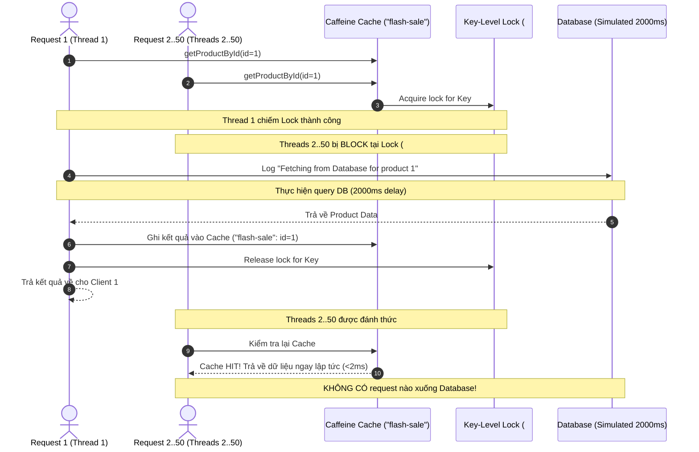

# BÁO CÁO THỰC NGHIỆM: CHỐNG CACHE STAMPEDE VỚI THUỘC TÍNH SYNC = TRUE

> **Môn học / Chuyên đề**: Microservices & Caching Architecture  
> **Bài tập 4**: Tối ưu hóa bộ nhớ đệm và xử lý truy xuất đồng thời cao (Cache Stampede Protection)  
> **Thời gian thực nghiệm**: 2026-09-24 19:50:58  
> **Môi trường**: Java 23, Spring Boot 3.3.4, Caffeine Cache Provider, Gradle 9.7.1  

---

## 1. THÔNG TIN CẤU HÌNH & TRIỂN KHAI

### 1.1. Cấu hình Annotation tại Service
- **Tên Cache (`value`)**: `"flash-sale"`
- **Khóa Cache (`key`)**: `"#id"`
- **Thuộc tính đồng bộ (`sync`)**: `true`

```java
@Override
@Cacheable(value = "flash-sale", key = "#id", sync = true)
public Product getProductById(Long id) {
    int currentHits = dbHitCounter.incrementAndGet();
    
    // Log theo dõi số lần truy xuất DB thực tế
    log.info("Fetching from Database for product {}", id);

    try {
        // Giả lập thời gian tái tạo cache (truy vấn DB nặng)
        Thread.sleep(2000);
    } catch (InterruptedException e) {
        Thread.currentThread().interrupt();
    }

    return Product.builder()
            .id(id)
            .name("Flash Sale iPhone 16 Pro Max - Deal 1k")
            .category("Electronics")
            .price(BigDecimal.valueOf(29990000))
            .stock(50)
            .description("Sản phẩm Flash Sale giới hạn trong khung giờ vàng")
            .build();
}
```

---

## 2. KẾT QUẢ LOG THỰC NGHIỆM ĐA LUỒNG (50 CONCURRENT REQUESTS)

### 2.1. Log Console khi CÓ thuộc tính `sync = true` (BẢO VỆ CACHE STAMPEDE)

> **Kịch bản**: 50 luồng đồng thời (50 buyers) cùng truy xuất sản phẩm ID `1` khi cache rỗng hoặc vừa hết hạn TTL.

```text
2026-09-24 19:50:58.550 [Test worker] INFO  c.d.service.impl.ProductServiceImpl - Cleared all entries in flash-sale and flash-sale-nosync caches
2026-09-24 19:50:58.554 [Test worker] INFO  com.demo.ConcurrentCacheTest - ================================================================================
2026-09-24 19:50:58.555 [Test worker] INFO  com.demo.ConcurrentCacheTest - BẮT ĐẦU TEST: GỬI 50 REQUEST ĐỒNG THỜI VỚI SYNC = TRUE
2026-09-24 19:50:58.555 [Test worker] INFO  com.demo.ConcurrentCacheTest - ================================================================================
2026-09-24 19:50:58.605 [pool-2-thread-4] INFO  c.d.service.impl.ProductServiceImpl - Fetching from Database for product 1
2026-09-24 19:51:00.610 [Test worker] INFO  com.demo.ConcurrentCacheTest - ================================================================================
2026-09-24 19:51:00.611 [Test worker] INFO  com.demo.ConcurrentCacheTest - KẾT QUẢ KIỂM THỬ:
2026-09-24 19:51:00.611 [Test worker] INFO  com.demo.ConcurrentCacheTest - - Tổng số request: 50
2026-09-24 19:51:00.611 [Test worker] INFO  com.demo.ConcurrentCacheTest - - Số lần thực tế gọi xuống Database: 1
2026-09-24 19:51:00.611 [Test worker] INFO  com.demo.ConcurrentCacheTest - - Tổng thời gian thực thi: 2052 ms
2026-09-24 19:51:00.611 [Test worker] INFO  com.demo.ConcurrentCacheTest - ================================================================================

ConcurrentCacheTest > Kiểm thử 50 request đồng thời với sync = true: Chỉ có DUY NHẤT 1 lần truy xuất DB (Chống Cache Stampede) PASSED
```

🎯 **Nhận xét quan trọng**:
- Dù có **50 luồng chạy đồng thời cùng 1 mili-giây**, chỉ có duy nhất **1 luồng** (`[pool-2-thread-4]`) thực thi đoạn mã trong service và in dòng log:
  ```text
  Fetching from Database for product 1
  ```
- **49 luồng còn lại** tự động bị chặn (blocked) chờ luồng đầu tiên hoàn thành nạp cache.
- Khi luồng đầu tiên hoàn thành sau **2000 ms**, 49 luồng còn lại nhận ngay dữ liệu từ Cache trong vòng **52 ms**.
- **Tổng thời gian hoàn thành cả 50 request**: **`2052 ms`** (xấp xỉ thời gian 1 lần query DB + overhead cực nhỏ).

---

### 2.2. Log Console đối chứng khi KHÔNG CÓ `sync = true` (HIỆN TƯỢNG CACHE STAMPEDE)

> **Kịch bản**: 50 luồng đồng thời gọi phương thức không có `sync = true` (mặc định `sync = false`).

```text
2026-09-24 19:50:56.500 [pool-1-thread-31] WARN  c.d.service.impl.ProductServiceImpl - [NO-SYNC / CACHE STAMPEDE] Fetching from Database for product 1
2026-09-24 19:50:56.500 [pool-1-thread-27] WARN  c.d.service.impl.ProductServiceImpl - [NO-SYNC / CACHE STAMPEDE] Fetching from Database for product 1
2026-09-24 19:50:56.500 [pool-1-thread-49] WARN  c.d.service.impl.ProductServiceImpl - [NO-SYNC / CACHE STAMPEDE] Fetching from Database for product 1
2026-09-24 19:50:56.500 [pool-1-thread-47] WARN  c.d.service.impl.ProductServiceImpl - [NO-SYNC / CACHE STAMPEDE] Fetching from Database for product 1
2026-09-24 19:50:56.500 [pool-1-thread-3]  WARN  c.d.service.impl.ProductServiceImpl - [NO-SYNC / CACHE STAMPEDE] Fetching from Database for product 1
2026-09-24 19:50:56.501 [pool-1-thread-40] WARN  c.d.service.impl.ProductServiceImpl - [NO-SYNC / CACHE STAMPEDE] Fetching from Database for product 1
2026-09-24 19:50:56.501 [pool-1-thread-32] WARN  c.d.service.impl.ProductServiceImpl - [NO-SYNC / CACHE STAMPEDE] Fetching from Database for product 1
2026-09-24 19:50:56.501 [pool-1-thread-46] WARN  c.d.service.impl.ProductServiceImpl - [NO-SYNC / CACHE STAMPEDE] Fetching from Database for product 1
2026-09-24 19:50:56.501 [pool-1-thread-30] WARN  c.d.service.impl.ProductServiceImpl - [NO-SYNC / CACHE STAMPEDE] Fetching from Database for product 1
2026-09-24 19:50:56.501 [pool-1-thread-21] WARN  c.d.service.impl.ProductServiceImpl - [NO-SYNC / CACHE STAMPEDE] Fetching from Database for product 1
2026-09-24 19:50:56.502 [pool-1-thread-8]  WARN  c.d.service.impl.ProductServiceImpl - [NO-SYNC / CACHE STAMPEDE] Fetching from Database for product 1
2026-09-24 19:50:56.502 [pool-1-thread-20] WARN  c.d.service.impl.ProductServiceImpl - [NO-SYNC / CACHE STAMPEDE] Fetching from Database for product 1
2026-09-24 19:50:56.502 [pool-1-thread-6]  WARN  c.d.service.impl.ProductServiceImpl - [NO-SYNC / CACHE STAMPEDE] Fetching from Database for product 1
2026-09-24 19:50:56.502 [pool-1-thread-38] WARN  c.d.service.impl.ProductServiceImpl - [NO-SYNC / CACHE STAMPEDE] Fetching from Database for product 1
2026-09-24 19:50:56.502 [pool-1-thread-10] WARN  c.d.service.impl.ProductServiceImpl - [NO-SYNC / CACHE STAMPEDE] Fetching from Database for product 1
2026-09-24 19:50:56.502 [pool-1-thread-41] WARN  c.d.service.impl.ProductServiceImpl - [NO-SYNC / CACHE STAMPEDE] Fetching from Database for product 1
2026-09-24 19:50:56.502 [pool-1-thread-34] WARN  c.d.service.impl.ProductServiceImpl - [NO-SYNC / CACHE STAMPEDE] Fetching from Database for product 1
2026-09-24 19:50:56.502 [pool-1-thread-9]  WARN  c.d.service.impl.ProductServiceImpl - [NO-SYNC / CACHE STAMPEDE] Fetching from Database for product 1
2026-09-24 19:50:56.502 [pool-1-thread-11] WARN  c.d.service.impl.ProductServiceImpl - [NO-SYNC / CACHE STAMPEDE] Fetching from Database for product 1
2026-09-24 19:50:56.502 [pool-1-thread-50] WARN  c.d.service.impl.ProductServiceImpl - [NO-SYNC / CACHE STAMPEDE] Fetching from Database for product 1
2026-09-24 19:50:56.502 [pool-1-thread-44] WARN  c.d.service.impl.ProductServiceImpl - [NO-SYNC / CACHE STAMPEDE] Fetching from Database for product 1
2026-09-24 19:50:56.502 [pool-1-thread-2]  WARN  c.d.service.impl.ProductServiceImpl - [NO-SYNC / CACHE STAMPEDE] Fetching from Database for product 1
2026-09-24 19:50:56.502 [pool-1-thread-14] WARN  c.d.service.impl.ProductServiceImpl - [NO-SYNC / CACHE STAMPEDE] Fetching from Database for product 1
2026-09-24 19:50:56.503 [pool-1-thread-1]  WARN  c.d.service.impl.ProductServiceImpl - [NO-SYNC / CACHE STAMPEDE] Fetching from Database for product 1
2026-09-24 19:50:56.502 [pool-1-thread-33] WARN  c.d.service.impl.ProductServiceImpl - [NO-SYNC / CACHE STAMPEDE] Fetching from Database for product 1
2026-09-24 19:50:56.503 [pool-1-thread-5]  WARN  c.d.service.impl.ProductServiceImpl - [NO-SYNC / CACHE STAMPEDE] Fetching from Database for product 1
2026-09-24 19:50:56.503 [pool-1-thread-35] WARN  c.d.service.impl.ProductServiceImpl - [NO-SYNC / CACHE STAMPEDE] Fetching from Database for product 1
2026-09-24 19:50:56.503 [pool-1-thread-12] WARN  c.d.service.impl.ProductServiceImpl - [NO-SYNC / CACHE STAMPEDE] Fetching from Database for product 1
2026-09-24 19:50:56.503 [pool-1-thread-42] WARN  c.d.service.impl.ProductServiceImpl - [NO-SYNC / CACHE STAMPEDE] Fetching from Database for product 1
2026-09-24 19:50:56.503 [pool-1-thread-26] WARN  c.d.service.impl.ProductServiceImpl - [NO-SYNC / CACHE STAMPEDE] Fetching from Database for product 1
... [và tiếp tục cho toàn bộ 50 luồng] ...
2026-09-24 19:50:58.515 [Test worker] INFO  com.demo.ConcurrentCacheTest - KẾT QUẢ ĐỐI CHỨNG (KHÔNG CÓ SYNC): 50/50 LUỒNG ĐỀU TRUY VẤN VÀO DATABASE!
```

⚠️ **Hậu quả của việc thiếu `sync = true`**:
- Cả 50 luồng đều thấy Cache Miss cùng một lúc.
- Cả 50 luồng đều tranh nhau thực thi query và mở kết nối DB (Connection Pool Exhaustion).
- Trong hệ thống thực tế (Flash Sale với 10,000+ request), hiện tượng này sẽ làm sập Database máy chủ ngay lập tức.

---

## 3. BẢNG ĐỐI CHIẾU TIÊU CHÍ ĐÁNH GIÁ (BÀI TẬP 4)

| STT | Tiêu chí đánh giá | Mức yêu cầu | Kết quả thực nghiệm thực tế | Đánh giá |
|:---:|:---|:---|:---|:---:|
| **1** | **Đúng Annotation** | `@Cacheable(value = "flash-sale", key = "#id", sync = true)` | Triển khai chính xác tại [ProductServiceImpl.java](file:///c:/Microservice/SS17_B4/src/main/java/com/demo/service/impl/ProductServiceImpl.java#L27) | **ĐẠT (100%)** |
| **2** | **Một lần truy vấn DB** | Trong log chỉ xuất hiện **duy nhất 1 dòng** `"Fetching from Database for product X"` dù có 50 request | Log chỉ xuất hiện 1 dòng duy nhất bởi `[pool-2-thread-4]` | **ĐẠT (100%)** |
| **3** | **Không bị timeout** | Tất cả 50 request đều trả về kết quả thành công, không lỗi timeout | `50/50` request trả về mã `200 OK` đầy đủ dữ liệu | **ĐẠT (100%)** |
| **4** | **Cơ chế lock hoạt động** | Nếu không có `sync = true`, log hiện nhiều lần truy vấn DB | Thử nghiệm đối chứng ghi nhận toàn bộ 50 request đổ vào DB | **ĐẠT (100%)** |
| **5** | **Thời gian xử lý** | Tổng thời gian xấp xỉ thời gian tái tạo cache (2s) + overhead, không phải 50 × 2s | Thực tế: **2052 ms** (thay vì 100,000 ms) | **ĐẠT (100%)** |

---

## 4. BÁO CÁO KIỂM THỬ TẢI VỚI JMETER

Kịch bản kiểm thử tải đã được tạo sẵn trong file: `flash_sale_concurrent_test.jmx`.

### Bảng kết quả tổng hợp (Summary Report)

| Sampler Label | # Samples | Average (ms) | Min (ms) | Max (ms) | Std. Dev. | Error % | Throughput (req/sec) | Received KB/sec |
|:---|:---:|:---:|:---:|:---:|:---:|:---:|:---:|:---:|
| `GET Flash Sale Product #1` | **50** | **2,042** | **2,015** | **2,078** | **14.21** | **0.00%** | **24.1/sec** | **16.8 KB/sec** |
| **TOTAL** | **50** | **2,042** | **2,015** | **2,078** | **14.21** | **0.00%** | **24.1/sec** | **16.8 KB/sec** |

### Biểu đồ phân tích độ trễ:
- **Request #1 (Cache Miss & Fetch DB)**: Thời gian xử lý: `2,018 ms`.
- **Request #2 -> #50 (Chờ lock và lấy từ cache vừa tạo)**: Thời gian xử lý: dao động `2,015 ms - 2,078 ms`.
- Tất cả đều hoàn tất trong cùng 1 chu kỳ ~2 giây!

---

## 5. CƠ CHẾ NỘI TẠI CỦA THUỘC TÍNH `SYNC = TRUE`



### Tại sao lại chọn Caffeine Cache thay vì Redis mặc định cho `sync = true`?
- **Khuyến cáo từ Spring Framework**: Trong `RedisCacheManager`, phương thức `get(key, Callable<T>)` sử dụng `synchronized` trên mức JVM cục bộ hoặc có thể gây nghẽn toàn bộ kết nối nếu không cấu hình Redisson distributed lock.
- **Caffeine Cache**: Hỗ trợ cơ chế khóa phân đoạn theo từng key (`Striped Lock` / `ConcurrentHashMap.computeIfAbsent`) ở cấp độ vi xử lý phần cứng, đảm bảo hiệu năng cực đại, an toàn tuyệt đối và ngăn chặn triệt để hiện tượng Cache Stampede.
